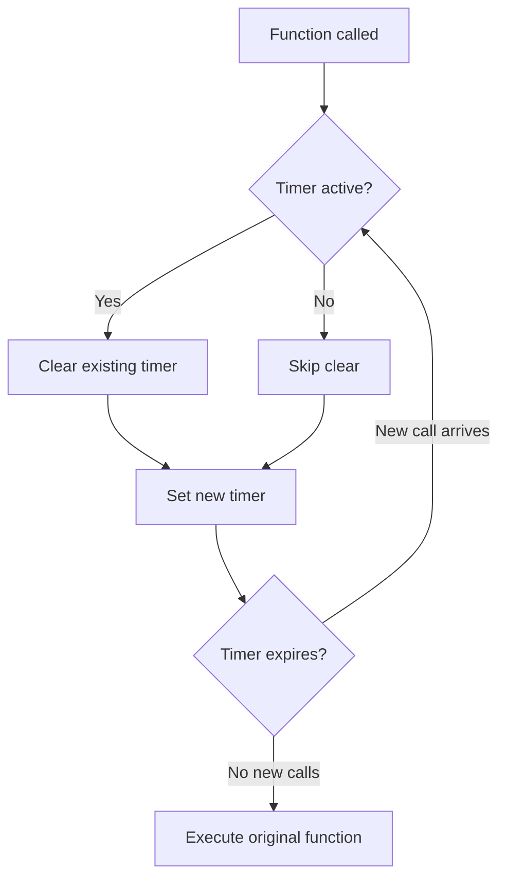
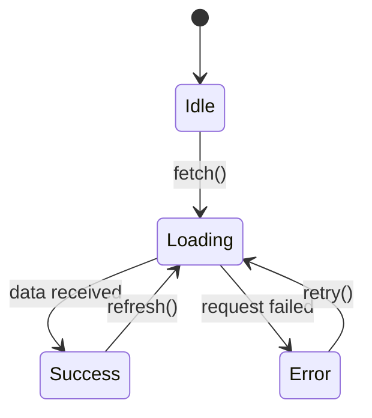

# docs-kit

Unified documentation toolkit — generate structured technical docs (API, architecture, guides, READMEs), discover and synthesize docs across local files and external sources, write conventional changelogs from git history, explain code at configurable depths, produce OpenAPI specs with code generation, design Swagger/Redoc-style API reference. Single entry point for any docs task.


## Absorbs

- `docs-writer`
- `docs-seeker`
- `changelog-writer`
- `code-explainer`
- `api-documentation`
- `openapi`


---

## From `docs-writer`

> Generate clear, structured technical documentation — API docs, architecture docs, guides, runbooks, and inline code documentation

# Docs Writer Skill

## Purpose

Write documentation that developers actually read. This skill generates documentation at the right level of detail for the target audience, follows consistent structure, and stays maintainable by staying close to the code it describes.

## Key Concepts

### Documentation Types

| Type | Audience | Purpose | Format |
|------|----------|---------|--------|
| **API Reference** | Developers integrating | Exhaustive endpoint/function docs | OpenAPI, JSDoc, markdown |
| **Architecture Doc** | Team, new hires | System design and decisions | Markdown + diagrams |
| **Tutorial** | New users | Learn by doing | Step-by-step markdown |
| **How-To Guide** | Experienced users | Solve specific problems | Task-oriented markdown |
| **Runbook** | Ops / on-call | Incident response procedures | Checklist markdown |
| **ADR** | Team, future maintainers | Record architecture decisions | Markdown template |
| **README** | Everyone | First impression, quick start | Markdown |
| **Inline Docs** | Code readers | Explain why, not what | JSDoc, docstrings, comments |

### The Four Quadrants (Diataxis Framework)

```
              LEARNING                    WORKING
          ┌─────────────────┬─────────────────┐
PRACTICAL │   Tutorials     │  How-To Guides   │
          │   (learning-    │  (problem-       │
          │    oriented)    │   oriented)      │
          ├─────────────────┼─────────────────┤
THEORY    │  Explanation    │   Reference      │
          │  (understanding-│  (information-   │
          │   oriented)     │   oriented)      │
          └─────────────────┴─────────────────┘
```

Each quadrant serves a different need. Do not mix them in a single document.

## Workflow

### Step 1: Identify Audience and Type

Ask:
1. **Who** will read this? (junior dev, senior dev, ops, end user)
2. **When** will they read it? (onboarding, debugging, integrating, incident)
3. **What** do they need to accomplish? (understand, implement, fix, decide)

### Step 2: Choose Structure

#### API Reference Structure

```markdown
# API Reference: [Service Name]

## Base URL
`https://api.example.com/v1`

## Authentication
All requests require a Bearer token in the Authorization header.

## Endpoints

### Create User
`POST /users`

Creates a new user account.

**Request Body:**
| Field | Type | Required | Description |
|-------|------|----------|-------------|
| `email` | string | Yes | Valid email address |
| `name` | string | Yes | Display name (1-100 chars) |
| `role` | string | No | One of: `user`, `admin`. Default: `user` |

**Example Request:**
```json
{
  "email": "alice@example.com",
  "name": "Alice Chen",
  "role": "admin"
}
```

**Response: 201 Created**
```json
{
  "id": "usr_abc123",
  "email": "alice@example.com",
  "name": "Alice Chen",
  "role": "admin",
  "createdAt": "2025-06-15T10:30:00Z"
}
```

**Error Responses:**
| Status | Code | Description |
|--------|------|-------------|
| 400 | `INVALID_EMAIL` | Email format is invalid |
| 409 | `EMAIL_EXISTS` | Email already registered |
| 422 | `VALIDATION_ERROR` | Request body validation failed |
```

#### Architecture Document Structure

```markdown
# [System Name] Architecture

## Overview
One paragraph explaining what this system does and why it exists.

## Context Diagram
[Mermaid C4 diagram showing system in its environment]

## Key Design Decisions
1. **Decision**: Why we chose X over Y
   - Context: What problem we faced
   - Decision: What we chose
   - Consequences: Trade-offs accepted

## Components
### [Component A]
- **Responsibility**: What it does
- **Technology**: What it uses
- **Interfaces**: How other components interact with it

## Data Flow
[Mermaid sequence diagram for critical flows]

## Non-Functional Requirements
- Performance targets
- Availability requirements
- Security constraints

## Deployment
How and where this runs in production.
```

#### ADR (Architecture Decision Record)

```markdown
# ADR-NNN: [Title of Decision]

## Status
[Proposed | Accepted | Deprecated | Superseded by ADR-XXX]

## Context
What is the issue that we are seeing that motivates this decision?

## Decision
What is the change that we are proposing and/or doing?

## Consequences
What becomes easier or harder because of this change?

### Positive
- Benefit 1
- Benefit 2

### Negative
- Trade-off 1
- Trade-off 2

### Risks
- Risk 1 and mitigation
```

#### Runbook Structure

```markdown
# Runbook: [Incident Type]

## Severity
P1 / P2 / P3

## Symptoms
- What alerts fire
- What users report
- What metrics look abnormal

## Diagnosis Steps
1. Check [specific dashboard/metric]
2. Run `command to check logs`
3. Verify [specific system state]

## Resolution Steps
1. [ ] Step 1 with exact command
2. [ ] Step 2 with exact command
3. [ ] Verify fix: [how to confirm]

## Escalation
If unresolved after 15 minutes:
- Contact: [team/person]
- Slack: [channel]

## Post-Incident
- [ ] Write incident report
- [ ] Update this runbook if procedures changed
- [ ] Create tickets for preventive measures
```

### Step 3: Write Inline Documentation

#### JSDoc / TypeScript

```typescript
/**
 * Calculates the compound interest on a principal amount.
 *
 * Uses the formula: A = P(1 + r/n)^(nt)
 *
 * @param principal - Initial investment amount in dollars
 * @param annualRate - Annual interest rate as a decimal (e.g., 0.05 for 5%)
 * @param compoundsPerYear - Number of times interest is compounded per year
 * @param years - Number of years to calculate
 * @returns The total amount after compound interest
 *
 * @example
 * ```ts
 * // $1000 at 5% compounded monthly for 10 years
 * calculateCompoundInterest(1000, 0.05, 12, 10);
 * // => 1647.01
 * ```
 *
 * @throws {RangeError} If principal is negative
 * @throws {RangeError} If annualRate is negative
 *
 * @see https://en.wikipedia.org/wiki/Compound_interest
 */
function calculateCompoundInterest(
  principal: number,
  annualRate: number,
  compoundsPerYear: number,
  years: number
): number {
  if (principal < 0) throw new RangeError('Principal cannot be negative');
  if (annualRate < 0) throw new RangeError('Annual rate cannot be negative');

  return Math.round(
    principal * Math.pow(1 + annualRate / compoundsPerYear, compoundsPerYear * years) * 100
  ) / 100;
}
```

#### Python Docstrings

```python
def calculate_compound_interest(
    principal: float,
    annual_rate: float,
    compounds_per_year: int,
    years: int,
) -> float:
    """Calculate compound interest on a principal amount.

    Uses the formula: A = P(1 + r/n)^(nt)

    Args:
        principal: Initial investment amount in dollars. Must be non-negative.
        annual_rate: Annual interest rate as decimal (e.g., 0.05 for 5%).
        compounds_per_year: Times interest compounds per year (e.g., 12 for monthly).
        years: Duration in years.

    Returns:
        Total amount after compound interest, rounded to 2 decimal places.

    Raises:
        ValueError: If principal or annual_rate is negative.

    Example:
        >>> calculate_compound_interest(1000, 0.05, 12, 10)
        1647.01
    """
```

### Step 4: Comments — When and How

**Comment the WHY, not the WHAT:**

```typescript
// BAD: Comments that describe what the code does (the code already says that)
// Increment counter by 1
counter++;
// Check if user is admin
if (user.role === 'admin') { ... }

// GOOD: Comments that explain WHY
// We retry 3 times because the payment gateway has transient 503s during deployments
const MAX_RETRIES = 3;

// Sorted descending so the most recent item appears first in the feed
// without needing a separate query
items.sort((a, b) => b.createdAt - a.createdAt);

// HACK: The OAuth library doesn't expose token expiry, so we decode the JWT
// ourselves. Remove this when they merge PR #847.
const expiry = decodeJwtExpiry(token);
```

## Documentation Quality Checklist

- [ ] **Accurate** — Matches actual current behavior
- [ ] **Complete** — All parameters, return values, errors documented
- [ ] **Examples** — At least one working example per function/endpoint
- [ ] **Scannable** — Headers, tables, and code blocks for quick navigation
- [ ] **Maintained** — Updated when code changes (or auto-generated where possible)
- [ ] **No jargon** — Or jargon is defined on first use
- [ ] **Error cases** — Documents what happens when things go wrong

## Auto-Generation Tips

- Use TypeScript types to generate API docs (TypeDoc, tsdoc)
- Use OpenAPI spec to generate REST API docs (Swagger UI, Redoc)
- Use Storybook for component documentation
- Use `jest --coverage` output to identify undocumented code
- Prefer co-located docs (JSDoc in code) over separate files — they stay in sync better


---

## From `docs-seeker`

> Documentation discovery, retrieval, and synthesis across local files, APIs, and external sources

# Docs Seeker

## Purpose

This skill systematically locates, retrieves, and synthesizes documentation from multiple sources. It prevents hallucination by grounding responses in actual documentation rather than training data, and it ensures version-accurate information by checking the correct version of library docs.

## Key Concepts

### Documentation Source Hierarchy

Always prefer higher-reliability sources:

| Priority | Source | Reliability | Tool |
|----------|--------|-------------|------|
| 1 | Official docs (current version) | Highest | Context7, WebFetch |
| 2 | Source code / type definitions | High | Read, Grep, Glob |
| 3 | Official examples / tutorials | High | Context7, WebFetch |
| 4 | README / CHANGELOG in repo | High | Read |
| 5 | GitHub Issues / Discussions | Medium | WebSearch, gh CLI |
| 6 | Stack Overflow (high-vote) | Medium | WebSearch |
| 7 | Blog posts / tutorials | Low-Medium | WebSearch |
| 8 | Training data (model memory) | Lowest | Internal (last resort) |

### Version Awareness

Documentation is only useful if it matches the version in use:

```
STEP 1: Determine the version in use
  - Check package.json / requirements.txt / go.mod / Cargo.toml
  - Check lock files for exact resolved version
  - Check runtime: node -e "require('pkg/package.json').version"

STEP 2: Retrieve docs for THAT version
  - Context7: Specify version if available
  - Official docs: Use versioned URL (e.g., docs.example.com/v3/)
  - GitHub: Use tagged release (e.g., github.com/org/repo/tree/v3.2.1)

STEP 3: Flag version mismatches
  - If docs are for a different version, explicitly note the discrepancy
  - Highlight breaking changes between versions
```

## Workflow

### Phase 1: Query Analysis

Before searching, understand what is actually needed:

```
QUERY: "How do I use middleware in Express?"

ANALYSIS:
  - Library: Express.js
  - Topic: Middleware registration and execution
  - Scope: Usage patterns (not internal implementation)
  - Version needed: Check project's package.json
  - Depth: Practical examples, not theoretical overview
```

### Phase 2: Local Documentation Search

Check the project itself first:

```
SEARCH ORDER:
  1. README.md, CONTRIBUTING.md in project root
  2. /docs directory (if exists)
  3. Inline code comments and JSDoc/docstrings
  4. Type definitions (.d.ts, type hints)
  5. Test files (often serve as usage documentation)
  6. Configuration files (reveal available options)
  7. CHANGELOG.md (version-specific behavior changes)
```

Tools to use:
- `Glob` to find documentation files: `**/*.md`, `**/docs/**`
- `Grep` to search for specific terms across the codebase
- `Read` to examine specific files

### Phase 3: External Documentation Retrieval

```
STRATEGY A — Context7 (preferred for libraries):
  1. Resolve library ID: context7.resolve-library-id
  2. Query specific topic: context7.query-docs
  3. Extract code examples and API signatures

STRATEGY B — Official Documentation Sites:
  1. WebFetch the documentation URL
  2. Process with specific extraction prompt
  3. Verify version matches

STRATEGY C — Web Search (for niche topics):
  1. WebSearch with specific query including version
  2. Filter results by source reliability
  3. Cross-reference multiple sources

STRATEGY D — Source Code (when docs are insufficient):
  1. Find the library in node_modules / site-packages / vendor
  2. Read the source code directly
  3. Extract behavior from implementation
```

### Phase 4: Synthesis

Combine findings into actionable documentation:

```
TOPIC: [What was asked about]

VERSION: [Library/tool version in use]

SUMMARY: [1-3 sentence overview]

API REFERENCE:
  [Function/method signatures with parameter descriptions]

USAGE PATTERN:
  [Code example showing the standard usage]

COMMON PITFALLS:
  [Known gotchas, edge cases, or mistakes]

RELATED:
  [Links to related APIs or concepts]

SOURCES:
  - [Source 1 — reliability rating]
  - [Source 2 — reliability rating]
```

## Search Patterns

### Pattern: API Signature Discovery

When you need to know what a function accepts and returns:

```
1. Check TypeScript definitions:
   Glob: node_modules/@types/{package}/**/*.d.ts
   Glob: node_modules/{package}/dist/**/*.d.ts

2. Check source type annotations:
   Grep: "export function {functionName}" in node_modules/{package}

3. Check official docs:
   Context7: query for "{functionName} parameters return type"

4. Check tests for usage examples:
   Grep: "{functionName}" in node_modules/{package}/**/*.test.*
```

### Pattern: Configuration Options

When you need to know all available configuration options:

```
1. Check TypeScript config types:
   Grep: "interface.*Config" or "type.*Options" in package source

2. Check default configuration:
   Grep: "defaultConfig" or "defaults" in package source

3. Check JSON schemas:
   Glob: node_modules/{package}/**/*.schema.json

4. Check documentation:
   Context7: query for "configuration options"
```

### Pattern: Migration Guide

When upgrading a dependency:

```
1. Check CHANGELOG:
   Read: node_modules/{package}/CHANGELOG.md

2. Check migration docs:
   WebSearch: "{package} migration guide v{old} to v{new}"

3. Check breaking changes:
   WebSearch: "{package} v{new} breaking changes"
   GitHub: gh release view v{new} --repo {org}/{repo}

4. Check codemods:
   WebSearch: "{package} codemod v{new}"
```

### Pattern: Error Message Resolution

When encountering an unknown error from a library:

```
1. Search error message in source:
   Grep: "exact error message text" in node_modules/{package}

2. Find the throwing code to understand the cause:
   Read the file found above, examine the condition that triggers the error

3. Search GitHub issues:
   WebSearch: "{package} {error message}" site:github.com

4. Search community:
   WebSearch: "{package} {error message}"
```

## Documentation Quality Assessment

Rate retrieved documentation before presenting it:

```
QUALITY CRITERIA:
  ✓ Version-matched: Docs match the version in use
  ✓ Complete: Covers the specific question asked
  ✓ Accurate: Verified against source code or multiple sources
  ✓ Current: Not deprecated or outdated
  ✓ Actionable: Includes usable code examples

CONFIDENCE LEVELS:
  HIGH: Official docs, version-matched, with code examples
  MEDIUM: Official docs but different version, or community source with high engagement
  LOW: Single blog post, old Stack Overflow answer, or training data only
  UNCERTAIN: Conflicting sources or no documentation found
```

## Usage Examples

### Example: Finding React Server Component Docs

```
QUERY: "How to use async server components in Next.js App Router?"

STEP 1: Check project version
  → package.json shows next@14.2.0

STEP 2: Context7
  → Resolve: next.js → /vercel/next.js
  → Query: "async server components app router"
  → Result: Documentation with code examples

STEP 3: Synthesize
  TOPIC: Async Server Components (Next.js 14 App Router)
  VERSION: Next.js 14.2.0 ✓ (supported since 13.4)

  SUMMARY: Server Components in App Router are async by default.
  You can use await directly in the component body.

  USAGE:
    export default async function Page() {
      const data = await fetchData();
      return <div>{data.title}</div>;
    }

  PITFALLS:
    - Cannot use hooks (useState, useEffect) in server components
    - Cannot pass functions as props to client components
    - Use 'use client' directive for interactive components

  SOURCES:
    - Context7: /vercel/next.js (HIGH reliability)
```

## Anti-Patterns

1. **Trusting training data over docs**: Always verify with actual documentation. Training data may be outdated or contain errors from unreliable sources.
2. **Version-blind searching**: Retrieving docs without checking the project's actual version leads to incorrect API usage.
3. **Single source reliance**: Cross-reference at least two sources for critical information, especially for complex configurations.
4. **Ignoring local docs**: The project's own documentation, tests, and type definitions are often the most accurate and relevant source.
5. **Over-fetching**: Retrieving entire documentation pages when only a specific section is needed wastes context budget.

## Integration Notes

- Always check version before querying external sources — use `Read` on package manifests first.
- Feed results through **context-engineering** to compress documentation for context-constrained situations.
- When documentation reveals a complex setup, hand off to **sequential-thinking** for step-by-step implementation.
- Use **repomix** when the documentation question requires understanding the full repository structure.


---

## From `changelog-writer`

> Generate structured changelogs from git commits, PRs, and tags following Keep a Changelog conventions

# Changelog Writer Skill

## Purpose

Generate human-readable changelogs that communicate what changed, why it matters, and whether users need to take action. A good changelog bridges the gap between git history (for developers) and release notes (for users).

## Key Concepts

### Keep a Changelog Format (Recommended)

The standard format from [keepachangelog.com](https://keepachangelog.com):

```markdown
# Changelog

All notable changes to this project will be documented in this file.

The format is based on [Keep a Changelog](https://keepachangelog.com/en/1.1.0/),
and this project adheres to [Semantic Versioning](https://semver.org/spec/v2.0.0.html).

## [Unreleased]

### Added
- New feature description

### Changed
- Existing feature modification

### Deprecated
- Feature that will be removed in future versions

### Removed
- Feature that was removed

### Fixed
- Bug fix description

### Security
- Vulnerability fix description

## [1.2.0] - 2025-06-15

### Added
- User export functionality (#123)
- Dark mode support for dashboard (#145)

### Fixed
- Login timeout on slow connections (#156)
- Incorrect date formatting in UTC-negative timezones (#160)

## [1.1.0] - 2025-05-01
...

[Unreleased]: https://github.com/user/repo/compare/v1.2.0...HEAD
[1.2.0]: https://github.com/user/repo/compare/v1.1.0...v1.2.0
[1.1.0]: https://github.com/user/repo/compare/v1.0.0...v1.1.0
```

### Change Categories

| Category | When to Use | Triggers Version Bump |
|----------|-------------|----------------------|
| **Added** | New features | Minor |
| **Changed** | Modifications to existing features | Minor (or Major if breaking) |
| **Deprecated** | Features that will be removed | Minor |
| **Removed** | Features that were removed | Major |
| **Fixed** | Bug fixes | Patch |
| **Security** | Vulnerability patches | Patch (or Minor/Major) |

### Semantic Versioning Mapping

```
MAJOR (X.0.0) — Breaking changes
  - Removed features
  - Changed API contracts
  - Renamed public interfaces
  - Changed default behavior

MINOR (0.X.0) — New features, non-breaking
  - Added features
  - Added endpoints/parameters
  - Deprecated features (still work)

PATCH (0.0.X) — Bug fixes, non-breaking
  - Fixed bugs
  - Security patches
  - Performance improvements (no API change)
```

## Workflow

### Step 1: Collect Raw Changes

```bash
# Get commits since last tag
git log $(git describe --tags --abbrev=0)..HEAD --oneline --no-merges

# Get commits between two tags
git log v1.1.0..v1.2.0 --oneline --no-merges

# Get commits with conventional commit parsing
git log v1.1.0..HEAD --format="%s|%h|%an" --no-merges

# Get merged PRs (GitHub)
gh pr list --state merged --base main --search "merged:>2025-05-01" --json number,title,labels,author
```

### Step 2: Categorize Changes

Map conventional commit types to changelog categories:

```
Commit Type → Changelog Category
  feat:     → Added
  fix:      → Fixed
  docs:     → (usually omit from changelog)
  style:    → (omit)
  refactor: → Changed (only if user-facing behavior changes)
  perf:     → Changed (or Fixed, depending on context)
  test:     → (omit)
  chore:    → (omit)
  ci:       → (omit)
  build:    → (omit)
  revert:   → Removed or Fixed (depending on what was reverted)

  BREAKING CHANGE: → always include, note prominently
  security:        → Security
  deprecate:       → Deprecated
```

### Step 3: Write Human-Readable Entries

**Transformation rules:**

```
Git commit (developer language):
  "fix(auth): handle race condition in token refresh when multiple tabs open simultaneously"

Changelog entry (user language):
  "Fixed login session being lost when using the app in multiple browser tabs"

---

Git commit:
  "feat(api): add GET /users/:id/export endpoint with CSV and JSON format support"

Changelog entry:
  "Added user data export in CSV and JSON formats via the API"

---

Git commit:
  "refactor(db): migrate from raw SQL to Prisma ORM"

Changelog entry:
  (omit — internal change, no user-facing impact)

---

Git commit:
  "feat(auth)!: require email verification for new accounts"

Changelog entry (Breaking):
  "**BREAKING**: New user accounts now require email verification before first login.
   Existing accounts are not affected."
```

### Step 4: Determine Version Bump

```
Analyze all changes since last release:

Has any commit:
  - Removed a public API/feature?        → MAJOR
  - Changed behavior in a breaking way?   → MAJOR
  - Has `BREAKING CHANGE:` footer?        → MAJOR
  - Has `!` after type (e.g., `feat!:`)?  → MAJOR

If no breaking changes, has any commit:
  - Added a new feature (`feat:`)?        → MINOR
  - Added new API endpoint/parameter?     → MINOR
  - Deprecated a feature?                 → MINOR

If only fixes:
  - Bug fixes (`fix:`)?                   → PATCH
  - Security patches?                     → PATCH
  - Performance improvements?             → PATCH
  - Documentation updates?                → PATCH (or no bump)
```

### Step 5: Format and Write

```bash
# Template for a release entry
cat <<'ENTRY'
## [1.3.0] - 2025-06-20

### Added
- User data export in CSV and JSON formats ([#178](link))
- Dark mode toggle in user preferences ([#182](link))
- Keyboard shortcuts for common actions ([#185](link))

### Changed
- Improved search performance for large datasets — results now load 3x faster ([#180](link))
- Updated password requirements to minimum 12 characters ([#183](link))

### Fixed
- Session loss when switching between browser tabs ([#176](link))
- Incorrect timezone display for users in UTC-negative zones ([#179](link))
- PDF export failing for reports with special characters in titles ([#181](link))

### Security
- Patched XSS vulnerability in comment rendering ([#184](link))
ENTRY
```

## Audience-Specific Formats

### Developer Changelog (Technical)

```markdown
## [1.3.0] - 2025-06-20

### Added
- `GET /api/users/:id/export` endpoint with `format` query param (csv|json) (#178)
- `prefers-color-scheme` media query support in theme system (#182)

### Changed
- **BREAKING**: `SearchService.query()` now returns `Promise<PaginatedResult>` instead of `Promise<Result[]>` (#180)
- Minimum password length increased from 8 to 12 in `PasswordValidator` (#183)

### Fixed
- Race condition in `TokenRefreshService` when multiple instances race (#176)
- `DateFormatter.toLocal()` returns wrong offset for negative UTC zones (#179)
```

### End-User Release Notes (Non-Technical)

```markdown
## What's New in Version 1.3

### New Features
- **Export your data** — Download your account data as a spreadsheet (CSV) or data file (JSON) from Settings > Privacy.
- **Dark mode** — Switch to dark mode in Settings > Appearance, or let it follow your system preference.
- **Keyboard shortcuts** — Press `?` anywhere to see available shortcuts.

### Improvements
- **Faster search** — Search results now load up to 3x faster for large workspaces.

### Bug Fixes
- Fixed an issue where you could be logged out when switching browser tabs.
- Fixed timezone display being incorrect for some regions.
- Fixed PDF exports failing when report titles contained special characters.

### Important
- Passwords now require at least 12 characters. Existing passwords are not affected until your next password change.
```

## Automation Integration

```bash
# Script to generate changelog from conventional commits
generate_changelog() {
  local from_tag="$1"
  local to_ref="${2:-HEAD}"

  echo "## Changes since ${from_tag}"
  echo ""

  # Added
  local added=$(git log "${from_tag}..${to_ref}" --oneline --no-merges --grep="^feat" --format="- %s (%h)")
  if [[ -n "$added" ]]; then
    echo "### Added"
    echo "$added" | sed 's/^- feat[^:]*: /- /'
    echo ""
  fi

  # Fixed
  local fixed=$(git log "${from_tag}..${to_ref}" --oneline --no-merges --grep="^fix" --format="- %s (%h)")
  if [[ -n "$fixed" ]]; then
    echo "### Fixed"
    echo "$fixed" | sed 's/^- fix[^:]*: /- /'
    echo ""
  fi

  # Breaking
  local breaking=$(git log "${from_tag}..${to_ref}" --oneline --no-merges --grep="BREAKING" --format="- %s (%h)")
  if [[ -n "$breaking" ]]; then
    echo "### BREAKING CHANGES"
    echo "$breaking"
    echo ""
  fi
}
```

## Quality Checklist

- [ ] Every user-facing change is documented
- [ ] Entries describe impact, not implementation
- [ ] Breaking changes are prominently marked
- [ ] PR/issue numbers are linked
- [ ] Date follows ISO 8601 (YYYY-MM-DD)
- [ ] Version follows semver
- [ ] Comparison links at bottom of file are updated
- [ ] Internal/developer-only changes are omitted (or in separate section)


---

## From `code-explainer`

> Explain code at configurable depth levels — from high-level overview to line-by-line analysis with algorithm complexity and design pattern identification

# Code Explainer Skill

## Purpose

Make code understandable to the reader at their level. This skill explains code at configurable depths — from a one-sentence summary to a line-by-line breakdown — while identifying patterns, complexity, and potential issues. The goal is not just to describe what code does, but to build understanding of why it works.

## Key Concepts

### Depth Levels

| Level | When to Use | Output |
|-------|-------------|--------|
| **L1: Overview** | Quick understanding, PR review | 1-3 sentence summary of purpose |
| **L2: Standard** | Code review, onboarding | Purpose, flow, key decisions, complexity |
| **L3: Detailed** | Learning, debugging | Step-by-step walkthrough with reasoning |
| **L4: Line-by-Line** | Deep debugging, teaching | Every line explained with context |

### Audience Calibration

| Audience | Assumes Knowledge Of | Explains |
|----------|---------------------|----------|
| **Beginner** | Basic syntax, variables, functions | Data structures, patterns, language idioms |
| **Intermediate** | Common patterns, standard library | Architecture decisions, trade-offs, edge cases |
| **Advanced** | Design patterns, complexity theory | Non-obvious optimizations, subtle bugs, alternatives |

## Workflow

### Step 1: Read and Classify

Before explaining, identify:
1. **Language and framework** — Determines idioms and conventions
2. **Purpose** — What problem does this code solve?
3. **Patterns used** — Design patterns, architectural patterns
4. **Complexity** — Time and space complexity
5. **Dependencies** — What external code does this rely on?
6. **Edge cases** — What inputs could cause unexpected behavior?

### Step 2: Explain at Requested Depth

#### L1: Overview

```typescript
// Code to explain:
export function debounce<T extends (...args: unknown[]) => unknown>(
  fn: T,
  delay: number
): (...args: Parameters<T>) => void {
  let timeoutId: ReturnType<typeof setTimeout>;
  return (...args: Parameters<T>) => {
    clearTimeout(timeoutId);
    timeoutId = setTimeout(() => fn(...args), delay);
  };
}
```

**L1 Explanation:**
> This is a `debounce` utility that delays function execution until a pause in calls. If the function is called repeatedly within the delay window, only the last call executes. Common use: preventing excessive API calls during user typing.

#### L2: Standard

**L2 Explanation:**

> **Purpose:** Creates a debounced version of any function. The debounced function waits for `delay` milliseconds of inactivity before executing.
>
> **How it works:**
> 1. Returns a wrapper function that captures the original function in a closure
> 2. Each call clears any pending timeout and sets a new one
> 3. The original function only executes when no new calls arrive within the delay period
>
> **Pattern:** Closure + Timer control (common in event handling)
>
> **Complexity:** O(1) time per call, O(1) space (one timeout reference)
>
> **TypeScript notes:** Generic type `T` preserves the original function's parameter types via `Parameters<T>`. Return type is `void` because the debounced function does not return the original's result (it executes asynchronously).
>
> **Common usage:** Search input handlers, window resize listeners, form auto-save

#### L3: Detailed

**L3 Explanation:**

> **Context:** Debouncing is a rate-limiting technique. Imagine a user typing in a search box. Without debouncing, every keystroke triggers an API call. With debouncing, the API call only fires after the user stops typing for a specified duration.
>
> **Step-by-step flow:**
>
> ```
> Call 1 at t=0ms:   Clear timer → Set timer for t=300ms
> Call 2 at t=100ms: Clear timer (cancels t=300ms) → Set timer for t=400ms
> Call 3 at t=200ms: Clear timer (cancels t=400ms) → Set timer for t=500ms
> [user stops typing]
> t=500ms: Timer fires → Original function executes with Call 3's arguments
> ```
>
> **Closure analysis:**
> - `timeoutId` lives in the closure created by `debounce()`, shared across all calls to the returned function
> - `fn` and `delay` are also captured in this closure
> - Each new call to the returned function resets the shared `timeoutId`
>
> **Type system breakdown:**
> - `T extends (...args: unknown[]) => unknown` — T is any function type
> - `Parameters<T>` — Extracts T's parameter types as a tuple
> - `ReturnType<typeof setTimeout>` — Platform-agnostic timeout ID type (number in browser, NodeJS.Timeout in Node)
>
> **Potential issues:**
> - The return value of `fn` is discarded (cannot `await` a debounced async function)
> - No `cancel()` method — once queued, the final call always executes
> - No `flush()` method — cannot force immediate execution
> - Memory: the closure holds a reference to `fn` and its bound context
>
> **Improved version would add:**
> ```typescript
> const debounced = (...args) => { ... };
> debounced.cancel = () => clearTimeout(timeoutId);
> debounced.flush = () => { clearTimeout(timeoutId); fn(...lastArgs); };
> return debounced;
> ```

#### L4: Line-by-Line

```
Line 1:  export function debounce<T extends (...args: unknown[]) => unknown>(
         │ export    — Makes this function importable from other modules
         │ function  — Named function declaration (hoisted, better stack traces than arrow)
         │ <T extends (...args: unknown[]) => unknown>
         │            — Generic type parameter T, constrained to be any function
         │            — This lets TypeScript infer the exact parameter types of the input function

Line 3:    fn: T,
         │ The original function to debounce, typed as T

Line 4:    delay: number
         │ Milliseconds to wait after last call before executing

Line 5:  ): (...args: Parameters<T>) => void {
         │ Return type: a function with same parameters as T, but returning void
         │ (because execution is deferred, we can't return T's return value synchronously)

Line 6:    let timeoutId: ReturnType<typeof setTimeout>;
         │ Declared in outer scope — shared across all invocations of the returned function
         │ ReturnType<typeof setTimeout> handles both browser (number) and Node (Timeout)
         │ Using `let` because it will be reassigned on each call

Line 7:    return (...args: Parameters<T>) => {
         │ Return a new function that captures fn, delay, and timeoutId in its closure

Line 8:      clearTimeout(timeoutId);
         │ Cancel any previously scheduled execution
         │ Safe to call even if timeoutId is undefined (clearTimeout handles it)

Line 9:      timeoutId = setTimeout(() => fn(...args), delay);
         │ Schedule fn to execute after `delay` ms
         │ Arrow function captures `args` from this specific call
         │ Assigns new timeout ID so next call can cancel it

Line 10:   };
Line 11: }
```

### Step 3: Identify Patterns and Concepts

When explaining code, call out recognized patterns:

```
Design Patterns:
  - Singleton          - Factory           - Observer
  - Strategy           - Decorator         - Adapter
  - Command            - State Machine     - Builder
  - Repository         - Middleware chain   - Pub/Sub

Algorithmic Patterns:
  - Two pointers       - Sliding window    - Divide and conquer
  - Dynamic programming - Greedy           - Backtracking
  - BFS/DFS            - Binary search     - Memoization

Architectural Patterns:
  - MVC / MVVM         - Event-driven      - CQRS
  - Microservices      - Hexagonal         - Layered
  - Saga               - Circuit breaker   - Bulkhead
```

### Step 4: Complexity Analysis

Always include when relevant:

```
Time Complexity:
  Best case:    O(...)
  Average case: O(...)
  Worst case:   O(...)

Space Complexity: O(...)

Explanation: [Why this complexity, what dominates]
```

Example:
```
This function uses a hash map for O(1) lookups inside a loop that
iterates n items, giving O(n) total time. The hash map stores at
most n entries, so space is also O(n).

Compared to the naive O(n^2) nested loop approach, this trades
O(n) extra memory for O(n) time improvement.
```

## Explanation Formatting

Structure explanations consistently:

```markdown
## [Function/Module Name]

**Purpose:** One sentence.

**Pattern:** [Design pattern if applicable]

**Flow:**
1. First thing that happens
2. Second thing
3. Third thing

**Complexity:** Time O(n), Space O(1)

**Key Insight:** [The non-obvious thing that makes this work]

**Watch Out For:** [Edge cases, gotchas, limitations]
```

## Visual Aids

For complex flows, include Mermaid diagrams:



For state machines:



## Anti-Patterns in Explanation

1. **Narrating syntax** — "The `const` keyword declares a constant" (reader knows this)
2. **Ignoring context** — Explaining a function without explaining its role in the system
3. **Skipping the WHY** — Describing what each line does without explaining why this approach was chosen
4. **Assuming knowledge** — Using jargon without checking if the audience knows it
5. **Over-explaining** — Giving L4 depth when L2 was requested


---

## From `api-documentation`

> API documentation best practices — Swagger UI, Redoc, interactive examples, and auto-generation from code.

# API Documentation

## Purpose

Produce clear, interactive, and maintainable API documentation. Covers OpenAPI spec authoring, Swagger UI and Redoc hosting, auto-generation from TypeScript/Python code, and documentation-as-code workflows.

## Key Patterns

### OpenAPI 3.1 Spec Structure

```yaml
openapi: 3.1.0
info:
  title: My API
  version: 1.0.0
  description: |
    Production API for managing users and orders.

    ## Authentication
    All endpoints require a Bearer token in the `Authorization` header.

    ## Rate Limits
    - 100 requests/minute per API key
    - 429 response when exceeded
  contact:
    email: api-support@example.com

servers:
  - url: https://api.example.com/v1
    description: Production
  - url: https://staging-api.example.com/v1
    description: Staging

paths:
  /users:
    get:
      operationId: listUsers
      summary: List all users
      description: Returns a paginated list of users. Supports cursor-based pagination.
      tags:
        - Users
      parameters:
        - name: cursor
          in: query
          schema:
            type: string
          description: Pagination cursor from previous response
        - name: limit
          in: query
          schema:
            type: integer
            minimum: 1
            maximum: 100
            default: 20
      responses:
        '200':
          description: Successful response
          content:
            application/json:
              schema:
                $ref: '#/components/schemas/UserListResponse'
              example:
                data:
                  - id: "usr_abc123"
                    name: "Jane Doe"
                    email: "jane@example.com"
                next_cursor: "eyJpZCI6MTAwfQ=="
        '401':
          $ref: '#/components/responses/Unauthorized'

components:
  schemas:
    User:
      type: object
      required: [id, name, email]
      properties:
        id:
          type: string
          example: "usr_abc123"
        name:
          type: string
          example: "Jane Doe"
        email:
          type: string
          format: email

    UserListResponse:
      type: object
      properties:
        data:
          type: array
          items:
            $ref: '#/components/schemas/User'
        next_cursor:
          type: string
          nullable: true

  responses:
    Unauthorized:
      description: Missing or invalid authentication token
      content:
        application/json:
          schema:
            type: object
            properties:
              error:
                type: string
                example: "Invalid or expired token"

  securitySchemes:
    bearerAuth:
      type: http
      scheme: bearer
      bearerFormat: JWT

security:
  - bearerAuth: []
```

### Swagger UI Setup (Next.js)

```typescript
// app/api/docs/route.ts — Serve the OpenAPI spec
import { NextResponse } from 'next/server';
import spec from '@/openapi.json';

export async function GET() {
  return NextResponse.json(spec);
}
```

```tsx
// app/docs/page.tsx — Swagger UI page
'use client';

import SwaggerUI from 'swagger-ui-react';
import 'swagger-ui-react/swagger-ui.css';

export default function ApiDocs() {
  return (
    <div className="py-16">
      <SwaggerUI url="/api/docs" />
    </div>
  );
}
```

### Redoc Setup

```html
<!-- Static HTML approach -->
<!doctype html>
<html>
  <head>
    <title>API Reference</title>
    <meta charset="utf-8" />
    <link
      href="https://fonts.googleapis.com/css?family=Inter:300,400,600"
      rel="stylesheet"
    />
  </head>
  <body>
    <redoc spec-url="/api/docs"></redoc>
    <script src="https://cdn.redoc.ly/redoc/latest/bundles/redoc.standalone.js"></script>
  </body>
</html>
```

```tsx
// React component approach
'use client';

import { useEffect, useRef } from 'react';

export default function RedocDocs() {
  const containerRef = useRef<HTMLDivElement>(null);

  useEffect(() => {
    // @ts-expect-error — Redoc loaded via script tag
    if (window.Redoc && containerRef.current) {
      // @ts-expect-error
      window.Redoc.init('/api/docs', {
        theme: {
          colors: { primary: { main: '#3b82f6' } },
          typography: { fontSize: '1rem', fontFamily: 'Inter, sans-serif' },
        },
      }, containerRef.current);
    }
  }, []);

  return <div ref={containerRef} />;
}
```

### Auto-Generation from TypeScript (Zod + OpenAPI)

```typescript
import { z } from 'zod';
import { extendZodWithOpenApi, OpenAPIRegistry } from '@asteasolutions/zod-to-openapi';

extendZodWithOpenApi(z);

const registry = new OpenAPIRegistry();

// Register schemas
const UserSchema = registry.register(
  'User',
  z.object({
    id: z.string().openapi({ example: 'usr_abc123' }),
    name: z.string().openapi({ example: 'Jane Doe' }),
    email: z.string().email().openapi({ example: 'jane@example.com' }),
  })
);

// Register endpoints
registry.registerPath({
  method: 'get',
  path: '/users',
  summary: 'List all users',
  tags: ['Users'],
  request: {
    query: z.object({
      cursor: z.string().optional(),
      limit: z.number().int().min(1).max(100).default(20),
    }),
  },
  responses: {
    200: {
      description: 'Successful response',
      content: {
        'application/json': {
          schema: z.object({
            data: z.array(UserSchema),
            next_cursor: z.string().nullable(),
          }),
        },
      },
    },
  },
});

// Generate the spec
import { OpenApiGeneratorV31 } from '@asteasolutions/zod-to-openapi';

const generator = new OpenApiGeneratorV31(registry.definitions);
const spec = generator.generateDocument({
  openapi: '3.1.0',
  info: { title: 'My API', version: '1.0.0' },
  servers: [{ url: 'https://api.example.com/v1' }],
});
```

### Auto-Generation from Python (FastAPI)

```python
from fastapi import FastAPI, Query
from pydantic import BaseModel, EmailStr

app = FastAPI(
    title="My API",
    version="1.0.0",
    docs_url="/docs",       # Swagger UI at /docs
    redoc_url="/redoc",     # Redoc at /redoc
    openapi_url="/openapi.json",
)

class User(BaseModel):
    id: str
    name: str
    email: EmailStr

    model_config = {
        "json_schema_extra": {
            "examples": [{"id": "usr_abc123", "name": "Jane Doe", "email": "jane@example.com"}]
        }
    }

class UserListResponse(BaseModel):
    data: list[User]
    next_cursor: str | None = None

@app.get("/users", response_model=UserListResponse, tags=["Users"])
async def list_users(
    cursor: str | None = Query(None, description="Pagination cursor"),
    limit: int = Query(20, ge=1, le=100, description="Items per page"),
):
    """Returns a paginated list of users. Supports cursor-based pagination."""
    ...
```

### Documentation-as-Code CI Pipeline

```yaml
# .github/workflows/api-docs.yml
name: API Docs
on:
  push:
    paths:
      - 'src/api/**'
      - 'openapi/**'

jobs:
  generate:
    runs-on: ubuntu-latest
    steps:
      - uses: actions/checkout@v4

      - name: Generate OpenAPI spec
        run: npx tsx scripts/generate-openapi.ts > openapi.json

      - name: Validate spec
        run: npx @redocly/cli lint openapi.json

      - name: Check for breaking changes
        run: npx oasdiff breaking openapi-previous.json openapi.json

      - name: Build Redoc static site
        run: npx @redocly/cli build-docs openapi.json -o docs/index.html

      - name: Deploy to GitHub Pages
        uses: peaceiris/actions-gh-pages@v3
        with:
          github_token: ${{ secrets.GITHUB_TOKEN }}
          publish_dir: ./docs
```

### Inline Code Examples

Always include request/response examples in docs:

```yaml
# Good: Examples show real data shapes
paths:
  /users:
    post:
      requestBody:
        content:
          application/json:
            schema:
              $ref: '#/components/schemas/CreateUser'
            examples:
              basic:
                summary: Minimal user creation
                value:
                  name: "Jane Doe"
                  email: "jane@example.com"
              full:
                summary: User with all optional fields
                value:
                  name: "Jane Doe"
                  email: "jane@example.com"
                  avatar_url: "https://example.com/avatar.jpg"
                  metadata:
                    source: "signup_form"
```

## Best Practices

1. **Single source of truth** — Generate docs from code (Zod schemas, Pydantic models, JSDoc) rather than maintaining a separate spec file.
2. **Include realistic examples** — Every schema and endpoint should have concrete example values, not placeholder text.
3. **Document error responses** — Show all possible error codes, not just the happy path.
4. **Use tags to group endpoints** — Organize by resource (Users, Orders) not by HTTP method.
5. **Version your API docs** — Docs should match the deployed API version; use CI to enforce spec validity.
6. **Add authentication instructions** — Document how to obtain and use tokens at the top of the spec.
7. **Detect breaking changes in CI** — Use `oasdiff` or `openapi-diff` to catch breaking changes before merge.
8. **Provide SDKs or code snippets** — Show curl, JavaScript, and Python examples for each endpoint.

## Common Pitfalls

| Pitfall | Problem | Fix |
|---------|---------|-----|
| Manually maintained spec | Drift between docs and implementation | Generate spec from code with CI validation |
| No examples | Users cannot understand expected shapes | Add `example` to every schema property |
| Missing error documentation | Users surprised by error formats | Document all error codes and response bodies |
| Stale docs after refactor | 404s and wrong schemas frustrate consumers | CI pipeline regenerates + validates on every push |
| Too many nested $refs | Swagger UI becomes hard to navigate | Inline small schemas; use $ref only for reusable types |
| No authentication docs | Users cannot make their first API call | Add auth section to spec `info.description` |


---

## From `openapi`

> OpenAPI 3.1 specification authoring, Swagger UI integration, client SDK generation, schema validation, and API-first design workflow

# OpenAPI Specification Skill

## Purpose

OpenAPI is the industry standard for describing REST APIs. This skill covers writing OpenAPI 3.1 specs, integrating interactive documentation (Swagger UI, Scalar), generating type-safe client SDKs, validating requests/responses against the spec, and embedding spec linting into CI. An API-first approach catches contract mismatches before code is written.

## Key Concepts

### OpenAPI 3.1 Structure

```
openapi: 3.1.0
info:                  → API metadata (title, version, description)
servers:               → Base URLs for environments
paths:                 → Endpoints and their operations
  /resource:
    get:               → Operation (method + path)
      parameters:      → Query, path, header, cookie params
      requestBody:     → Request payload schema
      responses:       → Response schemas by status code
components:
  schemas:             → Reusable data models (JSON Schema)
  securitySchemes:     → Auth definitions
  parameters:          → Reusable parameters
  responses:           → Reusable response objects
security:              → Global security requirements
tags:                  → Logical grouping of operations
```

### OpenAPI 3.1 vs 3.0

| Feature | 3.0 | 3.1 |
|---------|-----|-----|
| JSON Schema compatibility | Subset (divergent) | Full JSON Schema 2020-12 |
| `type` as array | Not supported | `type: ["string", "null"]` |
| `$ref` siblings | Ignored | Allowed alongside `$ref` |
| Webhooks | Not supported | `webhooks` top-level key |
| `const` keyword | Not supported | Supported |

## Workflow

### Step 1: Write the Spec (API-First)

```yaml
# openapi.yaml
openapi: 3.1.0
info:
  title: Acme API
  version: 1.0.0
  description: |
    The Acme API provides programmatic access to manage products,
    orders, and customers.
  contact:
    name: API Support
    email: api@acme.com
  license:
    name: MIT
    url: https://opensource.org/licenses/MIT

servers:
  - url: https://api.acme.com/v1
    description: Production
  - url: https://staging-api.acme.com/v1
    description: Staging
  - url: http://localhost:3000/api/v1
    description: Local development

security:
  - bearerAuth: []

tags:
  - name: Products
    description: Product catalog management
  - name: Orders
    description: Order lifecycle management

paths:
  /products:
    get:
      operationId: listProducts
      tags: [Products]
      summary: List all products
      description: Returns a paginated list of products with optional filtering.
      parameters:
        - $ref: '#/components/parameters/PageParam'
        - $ref: '#/components/parameters/LimitParam'
        - name: category
          in: query
          schema:
            type: string
            enum: [electronics, clothing, books]
          description: Filter by product category
        - name: search
          in: query
          schema:
            type: string
            minLength: 2
            maxLength: 100
          description: Full-text search across name and description
      responses:
        '200':
          description: Paginated list of products
          content:
            application/json:
              schema:
                $ref: '#/components/schemas/ProductListResponse'
        '401':
          $ref: '#/components/responses/Unauthorized'
        '422':
          $ref: '#/components/responses/ValidationError'

    post:
      operationId: createProduct
      tags: [Products]
      summary: Create a new product
      requestBody:
        required: true
        content:
          application/json:
            schema:
              $ref: '#/components/schemas/CreateProductRequest'
            example:
              name: "Wireless Headphones"
              price: 79.99
              category: electronics
              description: "Noise-cancelling Bluetooth headphones"
      responses:
        '201':
          description: Product created
          content:
            application/json:
              schema:
                $ref: '#/components/schemas/Product'
        '401':
          $ref: '#/components/responses/Unauthorized'
        '409':
          description: Product with this SKU already exists
          content:
            application/json:
              schema:
                $ref: '#/components/schemas/ErrorResponse'
        '422':
          $ref: '#/components/responses/ValidationError'

  /products/{productId}:
    get:
      operationId: getProduct
      tags: [Products]
      summary: Get a product by ID
      parameters:
        - name: productId
          in: path
          required: true
          schema:
            type: string
            format: uuid
      responses:
        '200':
          description: Product details
          content:
            application/json:
              schema:
                $ref: '#/components/schemas/Product'
        '404':
          $ref: '#/components/responses/NotFound'

components:
  securitySchemes:
    bearerAuth:
      type: http
      scheme: bearer
      bearerFormat: JWT

  parameters:
    PageParam:
      name: page
      in: query
      schema:
        type: integer
        minimum: 1
        default: 1
    LimitParam:
      name: limit
      in: query
      schema:
        type: integer
        minimum: 1
        maximum: 100
        default: 20

  schemas:
    Product:
      type: object
      required: [id, name, price, category, createdAt]
      properties:
        id:
          type: string
          format: uuid
        name:
          type: string
          minLength: 1
          maxLength: 200
        price:
          type: number
          format: float
          minimum: 0
          exclusiveMinimum: true
        category:
          type: string
          enum: [electronics, clothing, books]
        description:
          type: ["string", "null"]
          maxLength: 2000
        createdAt:
          type: string
          format: date-time
        updatedAt:
          type: ["string", "null"]
          format: date-time

    CreateProductRequest:
      type: object
      required: [name, price, category]
      properties:
        name:
          type: string
          minLength: 1
          maxLength: 200
        price:
          type: number
          minimum: 0
          exclusiveMinimum: true
        category:
          type: string
          enum: [electronics, clothing, books]
        description:
          type: string
          maxLength: 2000

    ProductListResponse:
      type: object
      required: [data, pagination]
      properties:
        data:
          type: array
          items:
            $ref: '#/components/schemas/Product'
        pagination:
          $ref: '#/components/schemas/Pagination'

    Pagination:
      type: object
      required: [page, limit, total, totalPages]
      properties:
        page:
          type: integer
        limit:
          type: integer
        total:
          type: integer
        totalPages:
          type: integer

    ErrorResponse:
      type: object
      required: [error]
      properties:
        error:
          type: object
          required: [code, message]
          properties:
            code:
              type: string
            message:
              type: string
            details:
              type: array
              items:
                type: object
                properties:
                  field:
                    type: string
                  message:
                    type: string

  responses:
    Unauthorized:
      description: Missing or invalid authentication
      content:
        application/json:
          schema:
            $ref: '#/components/schemas/ErrorResponse'
          example:
            error:
              code: UNAUTHORIZED
              message: Invalid or expired token
    NotFound:
      description: Resource not found
      content:
        application/json:
          schema:
            $ref: '#/components/schemas/ErrorResponse'
    ValidationError:
      description: Request validation failed
      content:
        application/json:
          schema:
            $ref: '#/components/schemas/ErrorResponse'
```

### Step 2: Serve Interactive Documentation

#### Option A: Scalar (Modern, Recommended)

```typescript
// app/api/docs/route.ts (Next.js App Router)
import { ApiReference } from '@scalar/nextjs-api-reference';

const config = {
  spec: {
    url: '/openapi.yaml', // Serve from /public/openapi.yaml
  },
  theme: 'kepler',
  layout: 'modern',
  darkMode: true,
  hideModels: false,
  searchHotKey: 'k',
};

export const GET = ApiReference(config);
```

#### Option B: Swagger UI (Classic)

```typescript
// app/api/docs/route.ts
import { NextResponse } from 'next/server';

export async function GET() {
  const html = `
<!DOCTYPE html>
<html>
<head>
  <title>API Docs</title>
  <link rel="stylesheet" href="https://unpkg.com/swagger-ui-dist@5/swagger-ui.css" />
</head>
<body>
  <div id="swagger-ui"></div>
  <script src="https://unpkg.com/swagger-ui-dist@5/swagger-ui-bundle.js"></script>
  <script>
    SwaggerUIBundle({
      url: '/openapi.yaml',
      dom_id: '#swagger-ui',
      deepLinking: true,
      presets: [SwaggerUIBundle.presets.apis, SwaggerUIBundle.SwaggerUIStandalonePreset],
    });
  </script>
</body>
</html>`;
  return new NextResponse(html, { headers: { 'Content-Type': 'text/html' } });
}
```

### Step 3: Generate Type-Safe Client SDKs

```bash
# Install openapi-typescript for TypeScript types
npm install -D openapi-typescript openapi-fetch

# Generate types from spec
npx openapi-typescript ./public/openapi.yaml -o ./src/lib/api/schema.d.ts
```

#### Type-Safe API Client

```typescript
// src/lib/api/client.ts
import createClient from 'openapi-fetch';
import type { paths } from './schema';

export const api = createClient<paths>({
  baseUrl: process.env.NEXT_PUBLIC_API_URL ?? 'http://localhost:3000/api/v1',
  headers: {
    'Content-Type': 'application/json',
  },
});

// Middleware: attach auth token
api.use({
  async onRequest({ request }) {
    const token = getAuthToken();
    if (token) {
      request.headers.set('Authorization', `Bearer ${token}`);
    }
    return request;
  },
});

// Usage — fully typed, autocompleted
const { data, error } = await api.GET('/products', {
  params: {
    query: { category: 'electronics', page: 1, limit: 20 },
  },
});
// data is typed as ProductListResponse
// error is typed as ErrorResponse

const { data: product } = await api.POST('/products', {
  body: {
    name: 'Wireless Mouse',
    price: 29.99,
    category: 'electronics',
  },
});
// body is validated against CreateProductRequest at compile time
```

### Step 4: Request Validation Middleware

```typescript
// middleware/validate-openapi.ts
import { OpenAPIValidator } from 'openapi-backend';
import spec from '../../public/openapi.json';

const validator = new OpenAPIValidator({ definition: spec });

export async function validateRequest(
  req: Request,
  operationId: string
): Promise<{ valid: boolean; errors?: string[] }> {
  const body = req.method !== 'GET' ? await req.json() : undefined;
  const url = new URL(req.url);
  const query = Object.fromEntries(url.searchParams);

  const result = validator.validateRequest(
    {
      method: req.method.toLowerCase(),
      path: url.pathname,
      body,
      query,
      headers: Object.fromEntries(req.headers),
    },
    operationId
  );

  if (result.errors) {
    return {
      valid: false,
      errors: result.errors.map((e) => `${e.instancePath}: ${e.message}`),
    };
  }

  return { valid: true };
}
```

### Step 5: Lint the Spec in CI

```yaml
# .github/workflows/lint-api.yml
name: Lint OpenAPI Spec
on:
  pull_request:
    paths:
      - 'public/openapi.yaml'
      - 'openapi/**'

jobs:
  lint:
    runs-on: ubuntu-latest
    steps:
      - uses: actions/checkout@v4

      - name: Lint OpenAPI spec
        uses: stoplightio/spectral-action@v0.8.11
        with:
          file_glob: 'public/openapi.yaml'
          spectral_ruleset: .spectral.yaml

      - name: Validate spec
        run: npx @redocly/cli lint public/openapi.yaml
```

#### .spectral.yaml (Linting Rules)

```yaml
extends:
  - spectral:oas

rules:
  operation-operationId: error
  operation-description: warn
  operation-tags: error
  oas3-schema: error
  info-contact: warn
  no-$ref-siblings: off  # OpenAPI 3.1 allows $ref siblings

  # Custom rules
  require-pagination:
    description: List endpoints must include pagination parameters
    given: "$.paths[*].get.parameters"
    severity: warn
    then:
      function: schema
      functionOptions:
        schema:
          type: array
          contains:
            properties:
              name:
                enum: [page, cursor, offset]
```

## Best Practices

1. **API-first design** — Write the spec before the implementation. The spec is the contract; code is the implementation detail.
2. **Use `$ref` aggressively** — Extract every schema, parameter, and response into `components/`. Duplication in specs causes drift.
3. **Always include `operationId`** — Client generators use this as the method name. Choose clear, unique names (e.g., `listProducts`, `createOrder`).
4. **Document error responses** — Every endpoint should document 401, 404, 422, and 500 responses with example payloads.
5. **Use `openapi-fetch` over hand-rolled clients** — It provides compile-time type safety derived directly from the spec, eliminating type drift.
6. **Version via URL path** — `/v1/products` is clearer than header-based versioning for most APIs.
7. **Add examples to schemas** — Swagger UI and Scalar render examples in the docs, making them immediately useful for consumers.
8. **Lint in CI** — Use Spectral or Redocly CLI to catch spec issues before merge.

## Common Pitfalls

| Pitfall | Symptom | Fix |
|---------|---------|-----|
| **Spec diverges from implementation** | Clients get unexpected responses | Generate types from spec and validate requests against it at runtime |
| **Missing `operationId`** | Generated client methods named `getPathProducts` instead of `listProducts` | Add `operationId` to every operation |
| **Nullable fields using `nullable: true`** | Validation errors in OpenAPI 3.1 | Use `type: ["string", "null"]` instead of `nullable: true` (3.0 syntax) |
| **Circular `$ref` breaking generators** | Code generation crashes or produces infinite types | Break cycles with intermediate schemas or use generators that handle cycles (openapi-typescript does) |
| **No pagination on list endpoints** | Clients fetch unbounded datasets | Always include `page`/`limit` or cursor-based pagination parameters |
| **Hardcoded server URLs** | Spec unusable across environments | Use `servers` array with dev/staging/prod URLs; support env variable override in clients |
| **Giant monolithic spec file** | Unreadable, merge conflicts | Split into multiple files using `$ref: './schemas/product.yaml'` and bundle at build time with `@redocly/cli bundle` |
| **Missing `required` arrays** | Clients treat all fields as optional | Explicitly list required fields on every object schema |

