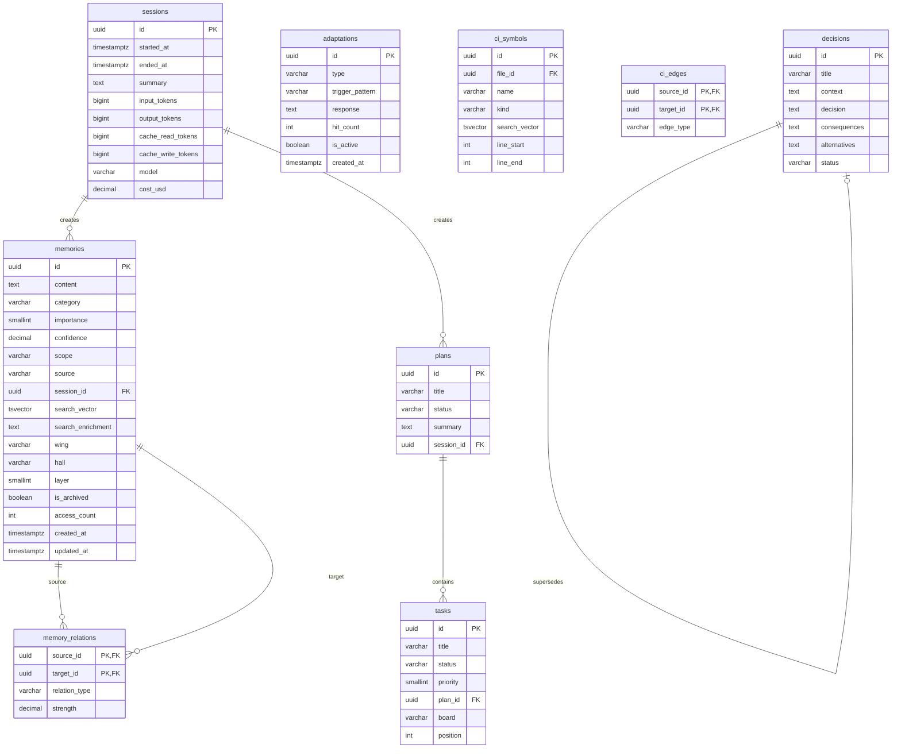

<p align="center">
  
</p>

<h1 align="center">UltraThink Core</h1>
<p align="center">
  <strong>The complete Workflow OS for Claude Code</strong><br />
  Persistent memory, 232-skill mesh, adaptive learning, code intelligence, privacy hooks, and an observability dashboard.
</p>

<p align="center">
  <a href="#install">Install</a> &bull;
  <a href="#core-exclusive-features">Core Features</a> &bull;
  <a href="docs/capability-matrix.md">Runner Matrix</a> &bull;
  <a href="#architecture">Architecture</a> &bull;
  <a href="#configuration">Configuration</a> &bull;
  <a href="#database-schema">Schema</a>
</p>

---

## What is UltraThink?

UltraThink transforms Claude Code from a stateless assistant into a **persistent, skill-aware agent** that remembers your decisions, enforces your standards, and adapts to your workflow across sessions.

```
You --> Claude Code --> UltraThink hooks fire --> Skills matched, memories recalled
                                                 --> Tekio adapts from failures
                                                 --> Code-intel graphs queried
                                                 --> Context injected into Claude
```

**Core** is the full, private distribution. Everything in [OSS](https://github.com/InugamiDev/ultrathink-oss) plus:

| Feature | OSS | Core |
|---------|:---:|:----:|
| 232-skill mesh | x | x |
| Persistent memory (Neon) | x | x |
| Privacy hooks | x | x |
| GateGuard (read-before-write) | x | x |
| Config protection | x | x |
| Hook profiles | x | x |
| Observability dashboard | x | x |
| AAAK compression | x | x |
| LongMemEval benchmark | x | x |
| **Tekio adaptive learning** | | x |
| **Code intelligence (MCP)** | | x |
| **Agent identity graph** | | x |
| **Decision engine** | | x |
| **VFS (AST signatures)** | | x |
| **Builder campaign system** | | x |

---

## Install

### macOS / Linux

```bash
git clone https://github.com/InugamiDev/ultrathink-core.git ~/ultrathink
cd ~/ultrathink
./scripts/setup.sh
./scripts/install.sh
```

### Windows (PowerShell)

```powershell
git clone https://github.com/InugamiDev/ultrathink-core.git $HOME\ultrathink
cd $HOME\ultrathink
npm install
.\scripts\install.ps1
```

> **Note:** Windows requires Git Bash (bundled with [Git for Windows](https://git-scm.com/download/win)) because hooks are `.sh` scripts. The installer registers hooks with `bash "path/to/hook.sh"` so they run through Git Bash automatically. No WSL needed.

### Requirements

| Requirement | macOS / Linux | Windows |
|-------------|--------------|---------|
| **Runtime** | Node.js 18+ | Node.js 18+ |
| **Shell** | bash (built-in) | [Git Bash](https://git-scm.com/download/win) (for hooks) |
| **CLI tools** | `jq` (`brew install jq`) | `jq` optional (PowerShell JSON used) |
| **Claude Code** | `npm i -g @anthropic-ai/claude-code` | `npm i -g @anthropic-ai/claude-code` |
| **Database** | [Neon](https://neon.tech) free tier | [Neon](https://neon.tech) free tier |
| **VFS** | `~/go/bin/vfs` | `~/go/bin/vfs.exe` |

See the [Versioned Capability Matrix](docs/capability-matrix.md) for Claude Code, Codex CLI, OpenAI API, Cursor, and other runner support.

### Installer flags

<table>
<tr><th>Bash</th><th>PowerShell</th><th>Description</th></tr>
<tr><td><code>--dry-run</code></td><td><code>-DryRun</code></td><td>Preview without changes</td></tr>
<tr><td><code>--yes</code></td><td><code>-Yes</code></td><td>Auto-approve all prompts</td></tr>
<tr><td><code>--uninstall</code></td><td><code>-Uninstall</code></td><td>Remove all links and hooks</td></tr>
<tr><td><code>--no-identity</code></td><td><code>-NoIdentity</code></td><td>Skip CLAUDE.md modification</td></tr>
<tr><td><code>--tier=core</code></td><td><code>-Tier core</code></td><td>Force tier (auto-detected)</td></tr>
<tr><td><code>--db=URL</code></td><td><code>-Db URL</code></td><td>Set database URL</td></tr>
<tr><td><code>--vault=PATH</code></td><td><code>-Vault PATH</code></td><td>Custom vault path</td></tr>
</table>

### Verify

```bash
claude
# UltraThink statusline appears with memory count, skills, and usage
# Try: "explain how Tekio works" -- agent identity + teaching mode activate
```

---

## Core-Exclusive Features

### Tekio — Cycle of Nova

Always-on adaptive learning. Evaluates every interaction:

**New -> learn. Known -> skip. Failure -> counter. Success -> reinforce.**

| Adaptation | Purpose |
|-----------|---------|
| **Defensive** (immunity) | Prevent known failures from recurring |
| **Auxiliary** (perception) | Detect issues before they happen |
| **Offensive** (approach) | Modify strategy to bypass obstacles |
| **Learning** (absorbed) | Successful patterns reinforced for reuse |

Adaptations are stored in the `adaptations` table and injected at session start as hard rules. Unlike fixed retry limits, Tekio has **infinite wheel spins** -- it never stops adapting.

```bash
npx tsx memory/scripts/memory-runner.ts wheel-stats    # View adaptation stats
npx tsx memory/scripts/memory-runner.ts wheel-list     # List all adaptations
npx tsx memory/scripts/memory-runner.ts wheel-turn     # Manual wheel turn
```

### Code Intelligence

Cross-file dependency graphs built on VFS + Neon Postgres. Deterministic code knowledge with no decay.

**5 MCP tools:**
- `code-symbols` -- Search symbol definitions by name/pattern/kind
- `code-deps` -- Outgoing edges: what does a symbol import/call/extend?
- `code-dependents` -- Incoming edges: what calls/imports this symbol?
- `code-impact` -- Transitive dependents up to N hops ("what breaks if I change X?")
- `code-modules` -- Semantic clusters grouped by directory + edge density

Hash-based incremental indexing (sha256 per file, skip unchanged). PostToolUse hooks auto-reindex on Edit/Write. Full reindex on session start if stale (>24h).

### VFS (Virtual File System)

AST-level file extraction -- returns function/class signatures without bodies. 60-98% token savings over reading full files.

```bash
mcp__vfs__extract(path: "src/file.ts")     # Signatures only (~200 tokens vs ~3000)
mcp__vfs__extract(path: "src/")            # Recursive directory scan
mcp__vfs__search(path: "src/", query: "handleAuth")  # Find symbols by name
mcp__vfs__stats(path: ".")                 # Project overview
```

### Agent Identity

First-class agent identity in `agent/core` L0 memory. The agent knows WHO it is, its rules, and its skill performance history.

```bash
npx tsx memory/scripts/memory-runner.ts agent-rules    # Agent rules + Tekio adaptations
npx tsx memory/scripts/memory-runner.ts identity       # Full identity graph
```

### Decision Engine

Hooks extract architectural decisions from conversations and store them with context, alternatives, and consequences. Decisions auto-inject into relevant future sessions.

---

## Architecture

```
+---------------------------------------------------------------+
|                        Claude Code CLI                         |
+---------------------------------------------------------------+
|                                                                |
|  SessionStart        PromptSubmit          PostToolUse         |
|  - memory-start      - prompt-analyzer.ts  - quality-gate     |
|  - codeintel-check   - memory-recall       - codeintel-index  |
|  - tekio-inject      - decision-inject     - memory-auto-save |
|  - builder-session   - skill-scoring       - tool-observe     |
|                                            - context-monitor  |
|  PreToolUse                                - privacy-hook     |
|  - privacy-hook                                               |
|  - gateguard         Stop                                     |
|  - config-protect    - memory-session-end                     |
|  - search-cap        - batch-quality                          |
|                      - pre-compact                            |
|                                                                |
|  +----------------------------------------------------------+ |
|  |            Neon Postgres (pgvector + pg_trgm)             | |
|  |                                                           | |
|  |  memories + memory_relations + memory_tags                | |
|  |  adaptations (Tekio)                                      | |
|  |  ci_symbols + ci_edges + ci_modules (Code-Intel)          | |
|  |  sessions + plans + tasks + decisions + journals          | |
|  |  hook_events + skill_usage + daily_stats                  | |
|  +----------------------------------------------------------+ |
|                          |                                     |
|  +----------------------------------------------------------+ |
|  |           Next.js 15 Dashboard (:3333)                    | |
|  |  Memory browser | Skill mesh | Hook stats | Usage        | |
|  |  Kanban | Plans | Analytics | Code graph | Settings      | |
|  +----------------------------------------------------------+ |
|                                                                |
|  +----------------------------------------------------------+ |
|  |              Skill Mesh (4 layers, 232 skills)            | |
|  |                                                           | |
|  |  Orchestrators (16) -> Hubs (20) -> Utils (61) -> Domain  | |
|  |  Auto-trigger: intent detection + 1-hop graph traversal   | |
|  +----------------------------------------------------------+ |
+---------------------------------------------------------------+
```

### Hook Lifecycle

| Event | Hook | What it does |
|-------|------|-------------|
| **SessionStart** | `memory-session-start.sh` | Recall memories, load Tekio adaptations |
| **SessionStart** | `codeintel-session-check.sh` | Reindex if stale (>24h) |
| **SessionStart** | `builder-session.sh` | Core tier session init |
| **UserPromptSubmit** | `prompt-submit.sh` | Score skills, recall memories, inject context |
| **UserPromptSubmit** | `decision-inject.sh` | Inject relevant architectural decisions |
| **PreToolUse** | `privacy-hook.sh` | Block `.env`, `.pem`, credentials |
| **PreToolUse** | `gateguard.sh` | Enforce read-before-write |
| **PreToolUse** | `config-protection.sh` | Block edits to 40+ linter/formatter configs |
| **PreToolUse** | `search-cap.sh` | Limit excessive search loops |
| **PostToolUse** | `post-edit-quality.sh` | Auto-format (Biome/Prettier), validate |
| **PostToolUse** | `post-edit-codeintel.sh` | Incremental code-intel reindex |
| **PostToolUse** | `tool-observe.sh` | Batch tool usage stats |
| **PostToolUse** | `context-monitor.sh` | Warn at 65%/75% context usage |
| **PostToolUseFailure** | `tool-failure-log.sh` | Log failures, feed Tekio |
| **PreCompact** | `pre-compact.sh` | Save state before context compaction |
| **Stop** | `memory-session-end.sh` | Flush memories, close session |
| **Stop** | `batch-quality.sh` | Batch format + typecheck all edited files |
| **Notification** | `desktop-notify.sh` | macOS desktop + Discord notifications |

### Hook Profiles

Control which hooks run via `UT_HOOK_PROFILE`:

| Profile | Hooks Active |
|---------|-------------|
| `minimal` | Privacy, gateguard only |
| `standard` (default) | All standard hooks |
| `strict` | All hooks including expensive checks |

Disable individual hooks: `UT_DISABLED_HOOKS=ut:pre:gateguard,ut:post:quality`

---

## Memory System

Postgres-backed **Second Brain** with 4 wings:

| Wing | Purpose | Halls |
|------|---------|-------|
| `agent` | Who the agent is | core, rules, skills |
| `user` | Who the user is | profile, preferences, projects |
| `knowledge` | What has been learned | decisions, patterns, insights, reference |
| `experience` | What happened | sessions, outcomes, errors |

**4-layer recall budget:**
- **L0** (~100 tokens): Agent + user core -- always loaded
- **L1** (~300 tokens): Rules, decisions, patterns -- essential context
- **L2** (~500 tokens): Insights, references, projects -- task context
- **L3** (on-demand): Experience -- searched, not preloaded

**3-tier hybrid search** with write-time synonym enrichment:
1. **tsvector** full-text search (best precision)
2. **pg_trgm** trigram fuzzy matching (typo-tolerant)
3. **ILIKE** substring fallback

**Zettelkasten linking** with typed relations: `learned-from | contradicts | supports | applies-to | caused-by | supersedes`

**Obsidian vault** at `~/.ultrathink/vault/` mirrors the 4-wing structure with MOC files and backlinks.

### AAAK Compression

Lossless shorthand dialect for context injection. ~1.5x compression, zero info loss.

```
Natural:  "Priya manages Driftwood: Kai (backend, 3yr), Soren (frontend), Maya (infra)..."
AAAK:     TEAM: PRI(lead) | KAI(backend,3yr) SOR(frontend) MAY(infra)
          PROJ: DRIFTWOOD(saas.analytics) | SPRINT: auth.migration->clerk
```

### LongMemEval Benchmark

50/50 (100%) across 5 abilities -- pure search ranking validation, no LLM in the loop.

| Ability | Score |
|---------|-------|
| Information Extraction | 10/10 |
| Multi-Session Reasoning | 10/10 |
| Temporal Reasoning | 10/10 |
| Knowledge Updates | 10/10 |
| Abstention | 10/10 |

```bash
npx vitest run tests/longmemeval.test.ts
```

---

## Configuration

### Environment Variables

```bash
# Required
DATABASE_URL="postgresql://<db_user>:<db_password>@<neon_host>/<db_name>?sslmode=require"

# Dashboard
NEXT_PUBLIC_APP_URL=http://localhost:3333
PORT=3333

# Optional -- Notifications
DISCORD_WEBHOOK_URL=""
SLACK_WEBHOOK_URL=""

# Optional -- Embedding provider
OPENAI_API_KEY=
```

### Project Configuration (`.claude/ck.json`)

```json
{
  "project": "ultrathink",
  "version": "1.0.0",
  "tier": "core",
  "codingLevel": "practical-builder",
  "memory": {
    "provider": "neon",
    "autoRecall": true,
    "writePolicy": "selective",
    "compactionThreshold": 100
  },
  "privacyHook": {
    "enabled": true,
    "sensitivityLevel": "standard",
    "logEvents": true
  },
  "dashboard": { "port": 3333 }
}
```

---

## Database Schema

<details>
<summary>Entity Relationship Diagram</summary>



</details>

### Key Indexes

| Table | Index | Type | Purpose |
|-------|-------|------|---------|
| memories | `search_vector` | GIN | Full-text search |
| memories | `content_trgm` | GIN (trigram) | Fuzzy matching |
| memories | `wing_layer` | B-tree | Layered recall |
| ci_symbols | `search_vector` | GIN | Symbol search |
| ci_symbols | `name_trgm` | GIN (trigram) | Fuzzy symbol lookup |

### Extensions Required

```sql
CREATE EXTENSION IF NOT EXISTS "uuid-ossp";
CREATE EXTENSION IF NOT EXISTS "vector";
CREATE EXTENSION IF NOT EXISTS "pg_trgm";
```

---

## Project Structure

```
ultrathink/
├── .claude/
│   ├── hooks/             # 40+ lifecycle hooks (shell + TypeScript)
│   ├── skills/            # 232 skill definitions (SKILL.md files)
│   │   └── _registry.json # Master index with triggers + graph edges
│   ├── agents/            # 10 specialized agent definitions
│   ├── references/        # Behavioral rules (loaded on demand)
│   └── commands/          # Slash commands
├── memory/
│   ├── migrations/        # 18 SQL migrations
│   ├── src/               # Memory core (CRUD, search, recall, AAAK, Tekio)
│   └── scripts/           # CLI runner, identity, vault sync
├── code-intel/
│   ├── src/               # Extractor, indexer, resolver, clusterer, query
│   └── dist/              # Compiled MCP tools
├── dashboard/             # Next.js 15 + Tailwind v4 (port 3333)
│   ├── app/               # 18+ pages (App Router)
│   ├── components/        # UI components
│   └── lib/               # DB client, config, types
├── harness/               # Agent runtime (Ink TUI)
├── mcp/                   # MCP servers (agora, memory)
├── scripts/
│   ├── install.sh         # Unified installer (OSS/Core auto-detect)
│   ├── vault-sync.ts      # Obsidian <-> Neon DB sync
│   └── ...
├── tests/                 # Vitest (LongMemEval, hooks, memory, AAAK)
├── widgets/               # macOS Ubersicht widget
├── docs/                  # Documentation
└── videos/                # Remotion + Manim promo videos
```

---

## CLI Commands

```bash
# Setup
./scripts/setup.sh                     # Full project setup
./scripts/install.sh                   # Install into ~/.claude/ globally
./scripts/install.sh --uninstall       # Remove from ~/.claude/

# Database
npm run migrate                        # Run pending migrations

# Dashboard
./scripts/dashboard.sh                 # Start dashboard (port 3333)

# Memory
npx tsx memory/scripts/memory-runner.ts session-start
npx tsx memory/scripts/memory-runner.ts search "query"
npx tsx memory/scripts/memory-runner.ts save "content" "category" 7
npx tsx memory/scripts/memory-runner.ts flush
npx tsx memory/scripts/memory-runner.ts identity
npx tsx memory/scripts/memory-runner.ts agent-rules
npx tsx memory/scripts/memory-runner.ts aaak-context

# Tekio
npx tsx memory/scripts/memory-runner.ts wheel-stats
npx tsx memory/scripts/memory-runner.ts wheel-list
npx tsx memory/scripts/memory-runner.ts wheel-turn

# Code Intelligence
node code-intel/dist/indexer.js index <directory>

# Vault
npx tsx scripts/vault-sync.ts vault-to-db
npx tsx scripts/vault-sync.ts db-to-vault
npx tsx scripts/vault-sync.ts rebuild

# Tests
npx vitest run
```

---

## Tier Boundary

Core contains proprietary systems that must **never** leak into OSS:

- `memory/src/adaptation.ts` -- Tekio adaptive learning
- `code-intel/` -- Code intelligence system
- `memory/scripts/identity.ts` -- Agent identity graph
- `.claude/hooks/decision-engine.ts` -- Decision extraction
- `.claude/hooks/tool-failure-log.sh` -- Tekio failure pipeline
- `scripts/upgrade-to-builder.sh` -- Core tier marker

Use `scripts/parity-check.sh` to verify OSS/Core boundary integrity.

---

## License

Proprietary. Internal use only.

---

<p align="center">
  Built by <a href="https://github.com/InuVerse">InuVerse</a>
</p>
