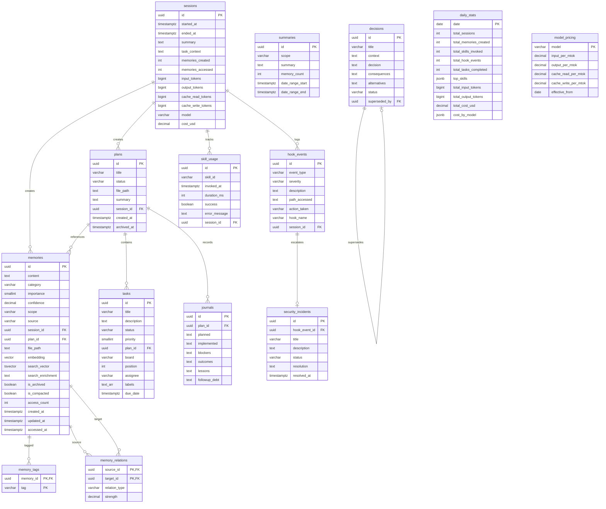

# Database Schema

UltraThink's database runs on Neon serverless Postgres with `uuid-ossp`, `pgvector`, and `pg_trgm` extensions.

## Entity Relationship Diagram



## Required Extensions

```sql
CREATE EXTENSION IF NOT EXISTS "uuid-ossp";
CREATE EXTENSION IF NOT EXISTS "vector";      -- pgvector
CREATE EXTENSION IF NOT EXISTS "pg_trgm";     -- trigram fuzzy search
```

## Key Indexes

| Table | Index | Type | Purpose |
|-------|-------|------|---------|
| memories | `search_vector` | GIN | Full-text search |
| memories | `content_trgm` | GIN (trigram) | Fuzzy matching |
| memories | `embedding` | IVFFlat | Vector similarity |
| memories | `scope_category` | B-tree | Scoped queries |
| hook_events | `event_type` | B-tree | Event filtering |
| hook_events | `severity` | B-tree | Severity filtering |
| skill_usage | `skill_id` | B-tree | Skill analytics |
| tasks | `board_status` | B-tree | Kanban queries |

## Tables Overview

### Core Tables

- **`sessions`** -- Tracks individual work sessions with start/end times, token usage, and cost
- **`memories`** -- Persistent memories with content, category, importance, confidence, and search vectors
- **`memory_tags`** -- Join table for tagging memories (composite PK: `memory_id` + `tag`)
- **`memory_relations`** -- Links memories with typed relationships (`supersedes`, `contradicts`, `extends`, `supports`, `related`)
- **`summaries`** -- Compacted memory summaries created during compaction

### Workflow Tables

- **`plans`** -- Plan metadata with status tracking (`draft` -> `active` -> `completed` -> `archived`)
- **`tasks`** -- Kanban board tasks with priority, assignee, labels, and due dates
- **`decisions`** -- Architecture Decision Records (ADRs) with self-referential `superseded_by`
- **`journals`** -- Journey journals created when plans are archived

### Observability Tables

- **`hook_events`** -- Audit trail for all hook executions (privacy, memory, quality)
- **`security_incidents`** -- Escalated security events from hook_events
- **`skill_usage`** -- Skill invocation analytics (timing, success/failure)
- **`daily_stats`** -- Aggregated daily statistics for the dashboard
- **`model_pricing`** -- Token pricing per model for cost tracking

## Migrations

Migrations are applied in order from `memory/migrations/`:

```bash
npm run migrate
```
